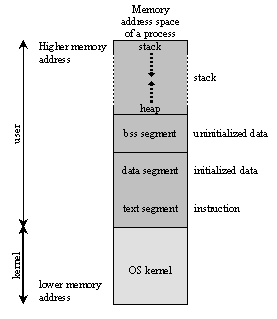
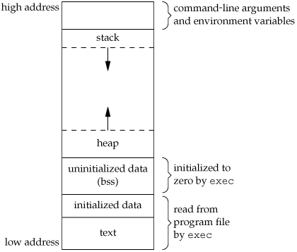

# Compiler/Linker memory map research

Our research notes, references and different notes about terms and examples used for inspiration during development of the Memory Map Plugin.

## Linker command files memory map analysis in general

All compilation requires a linker command file (configuration) of memory and hardware.

Especially for embedded system development they are in focus and memory are often limited.

The linker command file is to some extend common for all compilers.

* common syntax (not identical, nor compatible tbough)
* first part is the hardware cfg, tell the linker about the hardware
* second part is configuring which memory goes to what physical memory
* there are standard segments, for all compilers (eg. .text, .data and .bss)
* some compilers have their own names and special sections (.cinit for TI)
* there is a user defined section and layout as well

Typically the memory map file have _memory_ sections and another section called  _sections_ 

## Typical memory sections

* .text is program code

* .data is initialized data

* .bss is un-initialized data

[http://stackoverflow.com/a/1910006](http://stackoverflow.com/a/1910006)

Code and data size explained for text, data and bss: [http://mcuoneclipse.com/2013/04/14/text-data-and-bss-code-and-data-size-explained/](http://mcuoneclipse.com/2013/04/14/text-data-and-bss-code-and-data-size-explained/)

## Illustrations

## More information

* **Two linker-command files?**: There will always only be one pr. hardware setup and compilation, thus if users will build twice, they have to output also two memory map files - one pr. compilation.

* **Debug sections can be left out!**: Memory map files can contain debug information, which can be left out of the analysis, as debug symbols does not affect the target as they are not transferred to target.

* **Formats - dwarf, corf and elf**: dwarf and corf are usual output formats, while elf is for debugging

## Possible example projects

* **Hello world with ARM processor**: Example based on a book, but adjusted a bit. Could make the downloaded archive extract, or could find the original source in the book either: [http://www.bogotobogo.com/cplusplus/embeddedSystemsProgramming_gnu_toolchain_ARM_cross_compiler.php](http://www.bogotobogo.com/cplusplus/embeddedSystemsProgramming_gnu_toolchain_ARM_cross_compiler.php)

* **Memory layout of c program**: [http://www.geeksforgeeks.org/memory-layout-of-c-program/](http://www.geeksforgeeks.org/memory-layout-of-c-program/)

* **Examples from the O’reilly book on Embedded Programming**: [http://examples.oreilly.com/9780596009830/](http://examples.oreilly.com/9780596009830/)

## Tips and tricks

If declaring inside functions and memory usage isn’t change it might be on the stack:

[http://stackoverflow.com/questions/24431015/where-does-constant-local-variable-array-go-in-memory-for-a-c-program](http://stackoverflow.com/questions/24431015/where-does-constant-local-variable-array-go-in-memory-for-a-c-program)

## Linux command line tools

* size %programexecuteable

* readelf -a %programexecuteable

## Existing tools like the plugin

* Example on a script (script not available) using Javascript to graph memory use (nice graphs): [http://forum.micropython.org/viewtopic.php?t=577](http://forum.micropython.org/viewtopic.php?t=577)

* Another script example, Python: [http://stackoverflow.com/a/112078](http://stackoverflow.com/a/112078)

* StackAnalyser (commercial) [http://www.absint.com/stackanalyzer/](http://www.absint.com/stackanalyzer/)

* Map File Browser, simpel not so graphical tool: [http://www.sikorskiy.net/prj/amap/index.html](http://www.sikorskiy.net/prj/amap/index.html)

* mapfile, a google code project, could not really figure that tool out: [https://code.google.com/p/mapfile/](https://code.google.com/p/mapfile/)

* Another python script, to sum up memory: [http://www.microchip.com/forums/m533942.aspx](http://www.microchip.com/forums/m533942.aspx)

* Different homegrown scripts from different customers and organization that to some extend can analyse the memory maps.

## Resources

* O’Reilly book on Embedded Programming: [http://www.bogotobogo.com/cplusplus/files/embed/OReilly_Programming_Embedded_Systems_Second_edition_ebook.pdf](http://www.bogotobogo.com/cplusplus/files/embed/OReilly_Programming_Embedded_Systems_Second_edition_ebook.pdf)

    * Examples from the book to download: [http://examples.oreilly.com/9780596009830/](http://examples.oreilly.com/9780596009830/)

## Unknowns

* **Determine file formats**: How can we determine memory map output file or linker configuration file formats? We know for example that GCC 4.3.2 memory map output file format is different from GCC 4.8.2. Also that TI delivers in different formats from GCC and AIR.

* **BFD**: What is BFD? [http://www.eecs.umich.edu/courses/eecs373/readings/Linker.pdf](http://www.eecs.umich.edu/courses/eecs373/readings/Linker.pdf)

* **Can we establish a common "way" that all compiler/linkers work? Data structures, functionality supported, reporting formats etc. ?**

* **Ensure compatibility with core API plans?:** We already decided we want to move toward a generic memory map API where a core parses and delivers data and the Jenkins plugin can use that API. How can we already now try to work toward that approach without inflicting too much extra work on planned changes?

* **Ensure drill-down-data structure?:** We would like to support drill-down into data - how can we design toward that approach. *Mads could show current data flow and structures.*

* **Map files are not versioned!** I could find any descriptions or writing about if GCC describe their different memory map output file formats and that they are actually versioned. Researched mostly GCC.

